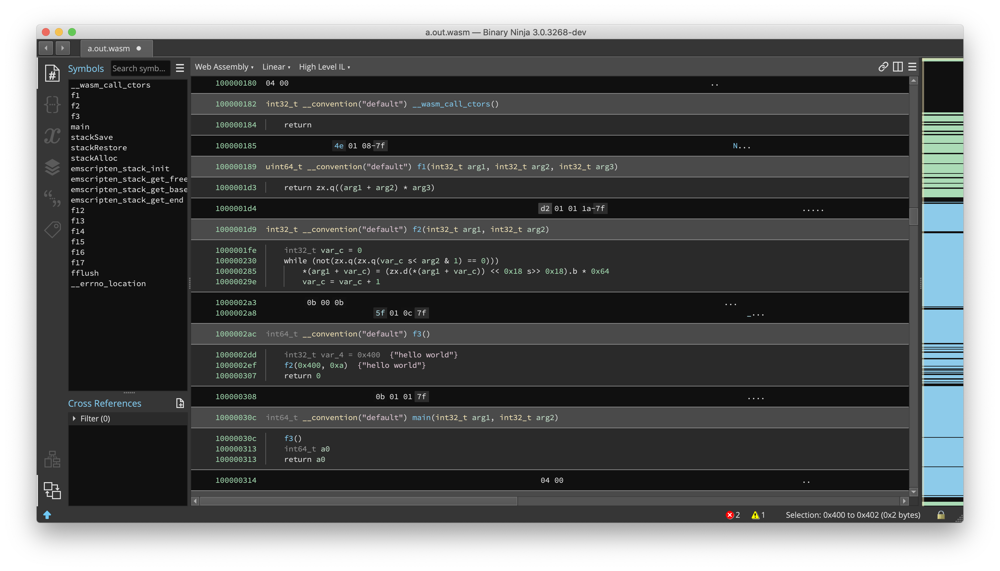
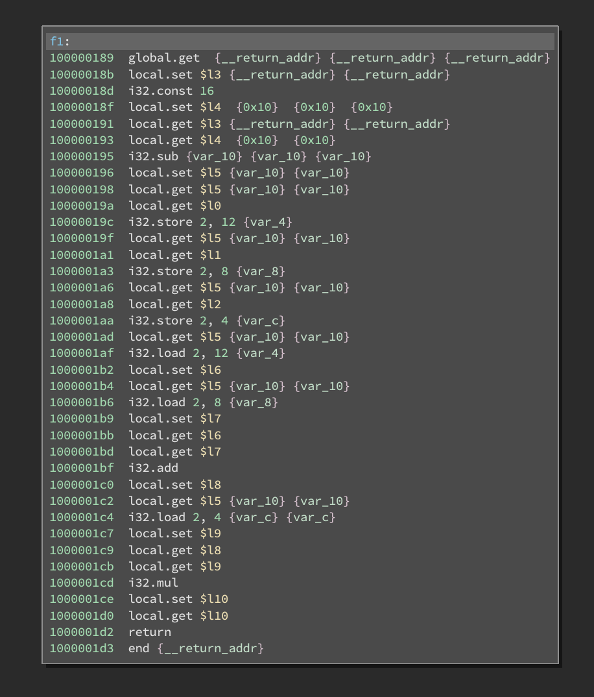
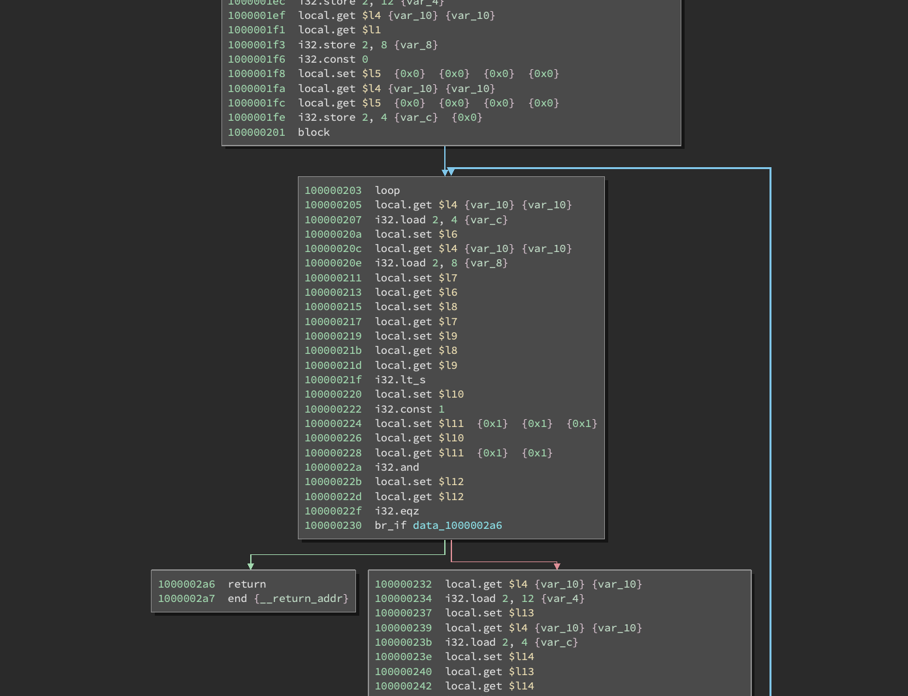

# bn-wasm

(work in progress) Binary Ninja WASM disassembler plugin.

## Status

WASM requires a fair bit of preprocessing to disassemble correctly (e.g. computing stack indices at every instruction, computing branch targets, etc...). Unlike a lot of other architectures, not all the information required to execute a given instruction is available in the actual instruction.

* Currently this plugin supports the WASM file format and properly loads code segments, applies symbols, etc...

* Most of the basic WASM instructions are implemented and lifted.

* Calling convention is still a bit broken.

* Performance is pretty bad and this plugin doesn't really run on large wasm files.

## Examples

Example program:

```c
int test(int a, int b, int c) {
    return (a + b) * c;
}

void test2(char *buf, int x) {
    for (int i = 0; i < x; ++i) {
        buf[i] = buf[i] * 100;
    }
}

int main() {
    test(1,2,3);

    char *data = "hello world";
    test2(data, 10);
}
```

HLIL view:



Instruction view (`test` function):



Branching/loops (`test2` function):


